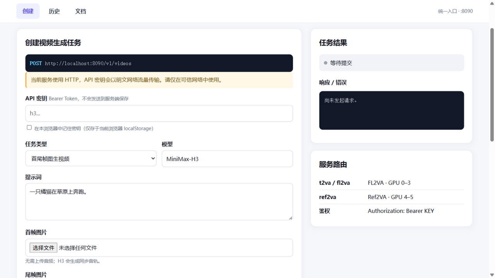
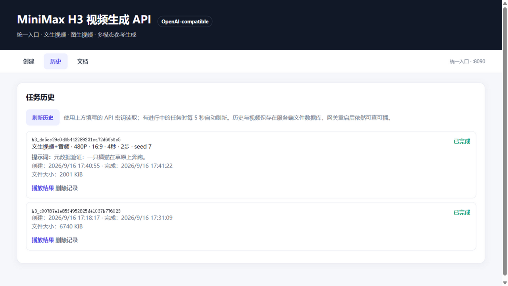

# MiniMax H3 Manager

面向自建 GPU 服务器的 **MiniMax-H3 视频生成统一服务**：一套 Docker Compose 编排（双推理后端 + 统一网关），
一个带交互式文档的中文 Web 控制台，外加若干对 vllm-omni 推理管线的增强补丁。

> MiniMax-H3 是 33B 全模态（视频+音频联合）生成模型，可输出 4–15 秒、24FPS、带原生立体声音轨的视频。
> 本项目不包含模型权重，仅提供服务编排、API 网关与推理能力增强。



## 功能特性

### 统一 API 网关（端口 8090）

- **统一模型名**：对外只暴露 `MiniMax-H3`，网关按请求内容自动路由到 FL2VA / Ref2VA 后端
- **异步任务 API**：`POST /v1/videos` 创建 → 轮询 → 下载，兼容常见的 Video Generation API 风格
- **同步生成 API**：`POST /v1/videos/sync` 直接返回 MP4，适合脚本与测试
- **Bearer 密钥鉴权**：密钥保存在服务端 `.env`（权限 600），校验透传后端
- **任务历史持久化**：SQLite 文件数据库 + 视频文件落盘，**网关重启后历史与视频依然可查可播**
- **SSRF 防护**：参考素材 URL 仅允许 data URL 与公网 http(s)，拒绝内网/环回/保留地址
- **任务元数据**：历史记录保存任务类型、提示词与生成参数，便于追溯

### 支持的生成模式

| 模式 | 输入 | 说明 |
|------|------|------|
| 文生视频（t2va） | 提示词 | 必须指定画面比例 |
| 首帧图生视频 | 提示词 + 首帧图 | 从给定首帧展开 |
| 尾帧图生视频 | 提示词 + 尾帧图 | 画面自然落到给定尾帧 |
| 首尾帧图生视频 | 提示词 + 首帧 + 尾帧 | 两帧之间平滑插值过渡 |
| 图片参考生成 | 提示词 + 参考图（1–4 张） | 多主体一致性；**音频可选**，用于指定音色 |
| 视频参考生成 | 提示词 + 参考视频 | 使用源视频音轨驱动运动与声音 |

分辨率支持 480P / 720P（768P），比例支持 21:9 / 16:9 / 4:3 / 1:1 / 3:4 / 9:16，时长 4–15 秒。
画面比例说明：文生视频、图片参考、视频参考按所选比例出片；首尾帧图生视频的画幅由首帧图片的比例决定（传 `adaptive`）。

### Web 控制台（中文交互式文档）

- 表单化创建各类任务，本页即可等待生成并播放结果
- 历史任务页：任务类型 / 参数 / 提示词 / 耗时一目了然，进行中任务**实时等待计时 + 每 5 秒自动刷新**，支持取消与删除
- 密钥可保存在浏览器 localStorage（仅当前浏览器，不上传服务端）
- 内置完整中文 API 文档与 curl 示例



### 推理管线增强补丁（`patches/`）

上游 vllm-omni 的 MiniMax-H3 支持矩阵较窄，本项目的补丁在不改动模型权重的前提下解锁：

1. **首帧 / 尾帧 / 首尾帧图生视频**：启用 `MINIMAX_H3_FL2VA_KEYFRAME_SIGNATURES` 中 `(0,) / (-1,) / (0,-1)`
   三种关键帧锚定（上游胶水层硬编码为首帧），多图条件编码、多槽位视觉表现、按帧索引打包全部打通
2. **image-only Ref2VA**：放开“图片参考必须搭配音频”的旧版实现限制，纯图片参考可用
   （与官方输入矩阵一致：只有 audio-only 被拒绝）

补丁以“锚点替换 + 容器内语法校验 + 失败即中止”的方式应用（见 `patches/patch_backend.py`），
`patches/files/` 内含打好补丁的最终文件，也可直接以 Dockerfile 方式构建镜像。

## 目录结构

```
minimax-h3-manager/
├── compose.yaml            # 三服务编排：h3-fl2va(GPU0-3) / h3-ref2va(GPU4-5) / h3-gateway
├── manage.sh               # 启停 / 日志 / 状态 / 冒烟测试 一键脚本
├── gateway/
│   ├── proxy.py            # 统一网关（FastAPI）：路由、鉴权、异步任务、持久化、SSRF 防护
│   └── index.html          # 中文 Web 控制台 + 交互式文档
├── patches/
│   ├── patch_backend.py    # 补丁应用器（锚点式，失败即中止）
│   ├── files/              # 打好补丁的 vllm-omni 源文件（供 Dockerfile 直接 COPY）
│   └── README.md           # 补丁说明与应用步骤
├── tests/
│   ├── api_test.py         # 全接口测试套件（29 用例，含持久化验证），输出 Markdown 报告
│   └── test-*.sh           # 各模式冒烟脚本
├── docs/                   # 展示页与截图（GitHub Pages 友好）
├── .env.example            # 环境变量样例
└── .gitignore
```

## 快速开始

### 0. 前置条件

- NVIDIA GPU 服务器（默认分配：GPU 0–3 给 FL2VA、GPU 4–5 给 Ref2VA，可在 compose.yaml 调整）
- Docker + NVIDIA Container Toolkit + docker compose
- 磁盘预留 ≥300GB（模型 + 镜像）

### 一键部署（推荐）

```bash
bash deploy.sh
```

脚本依次完成：前置检查 → 生成 `.env`（随机 API 密钥）→ 从魔搭 ModelScope 下载
MiniMax-H3 权重（已存在则跳过；仓库 ID 可用 `H3_MODELSCOPE_ID` 覆盖）→ 构建含补丁的
推理镜像 → 启动三服务并等待 healthy，最后打印控制台地址与密钥位置。

### 手动部署

#### 1. 构建推理镜像

```bash
# 方式 A：Dockerfile（推荐）
cd patches
docker build -t vllm/vllm-omni:minimax-h3 .

# 方式 B：对运行中的容器应用补丁后 commit
python3 patches/patch_backend.py            # 在已启动的基础容器内执行
docker commit minimax-h3-fl2va vllm/vllm-omni:minimax-h3
```

### 2. 配置并启动

```bash
cp .env.example .env
# 编辑 .env：设置 H3_API_KEY（自定义随机字符串）与 H3_MODEL_DIR（模型权重目录）
./manage.sh start
./manage.sh status          # 等待两个后端 healthy（首次加载需数分钟）
```

### 3. 使用

- 浏览器打开 `http://<服务器IP>:8090` —— 创建任务、查看历史、阅读文档
- 调用 API：

```bash
curl -X POST "http://localhost:8090/v1/videos" \
  -H "Authorization: Bearer $H3_API_KEY" \
  -H "Content-Type: application/json" \
  -d '{
    "model": "MiniMax-H3",
    "content": [{"type": "text", "text": "一只橘猫在草原上奔跑。"}],
    "resolution": "768P",
    "duration": 5,
    "ratio": "16:9"
  }'
```

### 4. 测试

```bash
python3 tests/api_test.py   # 29 项全接口测试，生成 Markdown 报告
./manage.sh key             # 查看服务端密钥
```

## API 摘要

| 方法 | 路径 | 说明 |
|------|------|------|
| POST | `/v1/videos` | 创建异步任务（202 返回任务 ID） |
| GET | `/v1/videos` | 任务列表（含任务类型 / 提示词 / 参数） |
| GET | `/v1/videos/{id}` | 查询状态 queued / in_progress / completed / failed / cancelled |
| GET | `/v1/videos/{id}/content` | 下载 MP4 |
| DELETE | `/v1/videos/{id}` | 取消进行中任务 / 删除记录与文件 |
| POST | `/v1/videos/sync` | 同步生成，直接返回 MP4 |
| GET | `/health` | 双后端健康聚合检查 |

生成请求体为核心是 `content[]` 多模态数组：`text` 提示词 + 若干带 `role` 的媒体项
（`first_frame` / `last_frame` / `reference_image` / `reference_audio` / `reference_video`），
完整字段说明见网关首页内置文档。

## 已知限制

- vllm-omni 推理路径的参考矩阵为 1 图（+1 音频）或多段视频；官方更宽的 9 图组合需 ComfyUI 路径
- 2K 分辨率未在 L40 配置上启用；推理步数默认 50（画质优先），无蒸馏加速
- 网关密钥经 HTTP 明文传输，请仅在可信网络暴露 8090 端口
- 纯图片参考生成（image-only Ref2VA）依赖本仓库补丁，生成音轨为模型自由发挥

## 许可证

Apache-2.0。模型权重权重遵循 MiniMax 官方许可，请另行确认商用条款。
